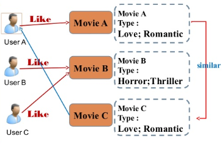

# 영화 추천 알고리즘 기반 커뮤니티 서비스

### MOVIETRAP

보통은 trap이라는 단어의 뜻을 **함정**이라고 알고있을 것입니다.

하지만 trap은 생각보다 다양한 뜻을 갖고 있는데, 그 중에서 **붙잡다**라는 뜻이 있습니다.

MOVIETRAP은 trap의 **붙잡다**라는 뜻을 따와서 `사용자들이 원하는 영화에 붙잡힐 수 있도록 하겠다`라는 의미를 담았습니다.

### 프로젝트 기간 📅

- 2023.05.17(수) ~ 2023.05.25(목)

### 기술 스택 🛠

- Front-end: Django template, Vanilla Javascript
- Back-end: Django

### 설치 가이드 💻

```
$ git clone 'repository url'
$ git lfs pull
```

```
$ pip install -r requirements.txt
$ python manage.py migrate
$ python manage.py loaddata genres.json movies.json
$ python manage.py runserver
```

## INDEX 📌

1. [팀원 정보 및 업무 분담 내역](#1-팀원-정보-및-업무-분담-내역)
2. [목표 서비스 구현 및 실제 구현 정도](#2-목표-서비스-구현-및-실제-구현-정도)
3. [데이터베이스 모델링 (ERD)](#3-데이터베이스-모델링-erd)
4. [영화 추천 알고리즘에 대한 기술적 설명](#4-영화-추천-알고리즘에-대한-기술적-설명)
5. [서비스 대표 기능에 대한 설명](#5-서비스-대표-기능에-대한-설명)
6. [기타 (느낀 점, 후기 등)](#6-느낀-점-후기)


## 1. 팀원 정보 및 업무 분담 내역

| 팀원 | 업무 내용 |
| :----: | :--------- |
| <a href="https://github.com/sun1h"><br>최혜원 (sun1h)</a> | <li>accounts 관련 기능 설계 및 개발 (로그인, 로그아웃, 회원정보수정, 회원탈퇴, 프로필, 팔로잉 기능)</li><li>community 관련 기능 설계 및 개발 (영화 한줄 감상평, 리뷰 작성 / 수정 / 삭제, 리뷰 댓글 작성)</li><li>영화 추천 알고리즘 (영화 OST 재생 및 영화 추천, 사용자가 좋아요 버튼을 누른 영화 기반 추천)</li><li>웹 페이지 디자인</li> <li>메인 페이지 일시정지, 음소거 기능 구현</li> <li>머신러닝 기반 영화 추천 알고리즘 구현</li> <li>비디오, ost 등 필요자료 수집</li> |
| <a href="https://github.com/sm9906"><br>김수민 (sm9906)</a> | <li>TMDB API키를 사용하여 영화 데이터 뽑아오기</li><li>movies 관련 기능 설계 및 개발 (메인 페이지 영화 인덱스, 영화 아이디 / 개봉일 / 평점 / 인기순 영화 조회 기능, 제목 기반 영화 검색 기능)</li><li>영화 추천 알고리즘 (영화 랜덤 추천, 장르별 영화 랜덤 추천)</li><li>웹 페이지 디자인</li> |

## 2. 목표 서비스 구현 및 실제 구현 정도

| 순번 | 기능 | 진행도 |
| -- | -- | -- |
| 1 | 로그인 ||    
| 2 | 회원가입 ||    
| 3 | 회원정보 수정 ||
| 4 | 프로필 페이지 ||    
| 5 | 팔로잉 기능 ||
| 6 | 전체 영화 조회 ||
| 7 | 상세 영화 조회 ||
| 8 | 영화 한 줄 감상평 작성 ||
| 9 | 영화 별점 주기 ||
| 10 | 영화 좋아요 기능 ||
| 11 | 리뷰 작성 / 조회 / 수정 / 삭제 ||
| 12 | 리뷰 댓글 작성 / 조회 / 삭제 ||
| 13 | 리뷰 좋아요 기능 ||
| 14 | OST 영화 추천 알고리즘 ||
| 15 | 장르별 영화 추천 알고리즘 ||
| 16 | 랜덤 영화 추천 알고리즘 ||
| 17 | MBTI별 영화 추천 알고리즘 ||


## 3. 데이터베이스 모델링 (ERD)


## 4. 영화 추천 알고리즘에 대한 기술적 설명

- ost로 추천받기

    영화 ost를 데이터에서 랜덤으로 가져와서 플레이어기와 함수로 연결해 놓았습니다. 재생버튼을 누를 시 영화 추천을 받을 수 있는 화면이 나타나고 버튼을 누르면 이에 해당하는 영화 제목과 영화 포스터가 나와 영화에 대한 정보를 제공할 수 있도록 하였습니다. 뒤로가기, 앞으로 가기 버튼을 누르면 url을 다시 불러오도록 하였습니다. 

- 좋아요 기반 추천받기

    유저가 특정 영화를 좋아요 하면 그 영화의 모든 장르를 추출하여 200개의 영화 중에 같은 장르의 영화를 유저에게 추천할 수 있도록 하였습니다. 추천된 영화를 클릭 시 movie detail로 돌아가 영화 정보를 확인 할 수 있도록 url을 연결하였습니다.

- 랜덤으로 추천받기

    장고 views.py에서 장고 orm을 통해 모든 영화 데이터들을 들고와서 영화 데이터를 랜덤으로 정렬하여 해당 리스트에서 영화 6개를 뽑아올 수 있도록 코드를 작성했습니다. 영화 추천 페이지에서 영화 추천받기 버튼을 눌렀을 때 해당 영화들이 나타날 수 있도록 바닐라 자바스크립트 코드를 작성하여 이벤트를 걸어주었고 각 영화들을 클릭하면 영화 상세페이지로 이동할 수 있도록 했습니다.

    ```python
    @login_required
    def recommendation(request):
        if request.user.is_authenticated:
            movies = Movie.objects.order_by('?')[:6]
        
        context = {
            'movies': movies,
        } 
        return render(request,'movies/recommendation.html',context)
    ```

- 장르별 추천받기

    랜덤으로 추천받기와 마찬가지로 장고 views.py에서 orm 코드를 작성하여 장르별로 데이터를 뽑아왔습니다. 액션, 로맨스, 코미디, 판타지, 애니메이션 이렇게 총 다섯가지 장르로 분류하였는데 페이지를 새로고침할 때 마다 해당 장르별로 영화가 랜덤으로 추천됩니다.


- 머신러닝 기반 영화 추천받기
    
    데이터는 Kaggle에서 받았습니다. Kaggle에는 다양한 알고리즘이 있는데, 이번 프로젝트는 유저 정보가 적기에 콘텐츠 기반 알고리즘을 채택하였습니다. 
    
    🔹 콘텐츠 기반 추천이란?
   
    콘텐츠 기반 추천은 사용자가 선호하는 콘텐츠와 비슷한 콘텐츠를 추천하겠다는 아이디어입니다. 
    

    🔹 코사인 유사도
    
    유클리디안 스칼라곱 공식에서 유도하여 내적공간의 두 벡터 간 각도의 코사인 값을 이용해 측정된 벡터 간의 유사한 정도를 의미합니다. 벡터의 크기가 아니라 방향의 유사도를 판단하는데 주 목적이 있습니다.

    
    
    영화의 제목을 입력받으면 코사인 유사도를 통해서 자기 자신을 제외한 가장 유사도가 높은 상위 10개의 영화 목록 반환하게 하였고 이를 판단하는 척도는 keywords, cast, director, genres로 설정하였습니다.


## 5. 서비스 대표 기능에 대한 설명 

**로그인**


- 로그인을 한 사용자만이 영화 상세페이지를 조회할 수 있으며, 영화 추천과 커뮤니티 서비스를 이용할 수 있습니다.
- 비밀번호를 잘못 입력한 경우 로그인 폼 상단에 올바른 정보를 입력하라는 경고가 생기면서 로그인을 막아줍니다.

**회원가입**


- 회원가입 유효성 검사를 통해 회원가입을 하려는 사용자가 유효하지 않은 정보를 기입할 경우 해당 정보를 다시 입력할 수 있도록 해줍니다.
- 이메일 주소는 입력하지 않아도 회원가입이 가능합니다. 하지만 이메일 주소를 입력할 경우에도 이메일 주소 형식을 맞춰 입력해야만 가입할 수 있습니다.

**메인 페이지**


- 비디오
    - 비디오의 왼쪽 상단에 영상을 멈추거나 다시 재생할 수 있는 버튼을 구현했습니다.
    - 영상을 멈추거나 다시 재생할 수 있는 버튼 옆에는 영상의 소리를 켜거나 끌 수 있는 버튼을 구현했습니다.

- 개봉 예정 및 최근 개봉 영화 / 인기있는 영화 / 평점 높은 영화
    - 각 테마에 해당하는 영화 데이터를 가져와 포스터를 보여줍니다.
    - 슬라이더 형식으로 구성하여 자동으로 영화 포스터들이 넘어가도록 구현했습니다.
    - 슬라이더의 양 옆과 하단에는 버튼을 만들어 사용자가 원할 때 버튼을 눌러 슬라이더를 넘길 수 있습니다.
    - 영화 포스터에 마우스를 올리면 영화 포스터가 확대되어 보입니다.
    - 영화 포스터를 클릭하면 해당 영화의 상세 페이지로 이동합니다.

**전체 영화 조회**


- 모든 영화 데이터들을 조회할 수 있습니다. 하단의 페이지네이션을 통해서 한 페이지당 18개의 영화목록이 나타납니다.
- 영화 포스터에 마우스를 올리면 영화 포스터가 180도 뒤집어지며 해당 영화의 제목이 나타납니다.
- 영화 포스터를 클릭하면 해당 영화의 상세 페이지로 이동합니다. 로그인을 하지 않은 사용자가 클릭했을 때는 로그인 페이지로 이동합니다.
- 영화 포스터 목록 오른쪽 상단에 드롭다운 버튼을 통해 인기순 / 최신순/ 오래된순/ 평점높은순으로 영화 목록을 조회할 수 있습니다.

**영화 검색**


- 검색어를 입력하면 해당 검색어를 제목에 포함하고있는 영화들이 검색 결과창에 나타납니다.

**영화 상세 조회**


- 해당 영화를 찜할 수 있습니다.
- 영화 정보 하단에 한줄 감상평을 작성하고 별점을 줄 수 있습니다.
- 한줄 감상평은 수정이 불가능하며 삭제만 가능합니다.

**영화 추천**


- OST로 영화추천
- 사용자가 찜한 영화를 기반으로 한 영화추천
- 영화 랜덤 추천
- 장르별 영화 추천
- 머신러닝 영화 추천

**커뮤니티**


- 커뮤니티
    - 다른 사용자들이 작성한 모든 영화 리뷰들을 조회할 수 있습니다.
    - 리뷰 카드에 마우스를 올리면 리뷰 카드가 조금 확대되어 보입니다.
    - 리뷰 카드를 클릭하면 해당 리뷰 상세 페이지로 이동합니다.
    - 화면 오른쪽 상단에 있는 리뷰 작성 버튼을 누르면 리뷰를 작성할 수 있습니다.
    - 리뷰를 작성한 사용자라라면 본인이 작성한 리뷰 상세 페이지에서 리뷰를 수정하거나 삭제할 수 있습니다.

- 리뷰 상세 조회
    - 해당 리뷰에 좋아요를 누를 수 있습니다.
    - 해당 리뷰를 작성한 사용자의 이름을 누르면 해당 사용자의 프로필 페이지로 이동합니다.
    - 리뷰에 댓글을 작성할 수 있습니다. 댓글은 수정할 수 없으며 삭제만 가능합니다.

**프로필**


- 본인의 프로필에서는 회원정보수정 버튼을 눌러 회원정보를 수정할 수 있습니다.
- 본인의 팔로워와 팔로잉 수를 확인할 수 있습니다. 다른 사용자의 프로필 페이지에 들어갔을 때는 해당 사용자를 팔로우하거나 언팔로우가 가능합니다.
- 사용자가 찜한 영화와 리뷰를 작성한 영화를 확인할 수 있는데 찜한 영화나 리뷰를 작성한 영화가 없다면 `영화 찜하러가기`, `리뷰 남기러 가기` 라는 문구에 링크가 걸려있어 해당 문구를 클릭하여 페이지를 이동할 수 있습니다. 

**회원 정보 수정**


- 사용자의 이메일 주소와 이름 성을 수정할 수 있습니다.
- 비밀번호를 바꾸고 싶다면 회원 정보 수정 폼 하단의 비밀번호 변경 폼 링크를 눌러 비밀번호 변경 폼에서 비밀번호를 변경 가능합니다.

**Not Found 페이지 처리**


- 유효하지 않은 url로 들어갔을 경우 무조건 메인페이지로 들어올 수 있도록 했습니다.

## 6. 느낀 점, 후기

<table border="1">
    <tr>
        <td align="center"> 최혜원 </td>
        <td> 
            <p>생각보다 초반 계획을 탄탄히 짜는 것이 중요하다고 느꼈습니다. 중간중간 필요한 데이터나 수정사항이 많이 생기므로 초반에 자세한 계획과 설정을 잡는 것이 무엇보다 중요하다고 느껴졌습니다. 간단한 알고리즘도 다양한 방식으로 구현해 낼 수 있는 점이 흥미로웠습니다. </p>
            <p>에러를 만나고 해결하는 과정에서 DB가 어떤 식으로 움직이는지, ERD가 얼마나 중요한지 등 이번 기회를 통해 감을 잡은 것 같습니다. 또한, ost로 영화 추천받기, 머신러닝으로 영화 추천받기, 좋아요 기반으로 영화 추천받기 등 영화 추천 알고리즘을 세우면서 백앤드 업무의 감을 잡고 이를 html로 연결하면서 프론트 업무도 수행하여 좋은 기회였다고 생각합니다.</p> </td>
    </tr>
    <tr>
        <td align="center">김수민</td>
        <td>
            <p>5월 17일부터 프로젝트 시작이었지만 저희 팀은 기획을 미리 해놓는게 좋을것 같다는 판단을 하여 16일부터 웹페이지의 컨셉은 어떻게 할 것인지, 그리고 영화 추천 알고리즘은 어떤식으로 작성해야 좋을지에 대해 다양한 아이디어를 내놓았습니다. 그렇지만 그냥 단순히 이러이러한 기능을 구현하면 참 좋을 것 같다는 식의 아이디어만 넘쳐날 뿐, 어떻게 구현할 것인지에 대해 탄탄하게 계획을 세우지 못했고, 이러한 경험으로 기능을 구현하기 전에 계획을 자세히 짜는 것의 중요성을 느꼈습니다. </p>
            <p>그리고 그동안 교육 내용들을 충실히 복습하지 못했던 점을 조금 후회했던 것 같습니다. 생각보다 알고 있던 내용임에도 프로젝트에서 다른 자료들을 참고하지 않고 바로바로 활용하기에는 아직 제가 많이 미숙하고 부족하다고 느꼈고, 협업툴을 사용하는 데에 있어서도 여전히 어렵다고 느꼈습니다. 앞으로 다른 프로젝트를 하기위해서는 더 많은 내용들을 습득하여 활용할 수 있도록 해야 할 것 같습니다.</p>
            <p>생각보다 프로젝트를 마무리해야 하는 시간이 짧았기에 많은 아쉬움도 남습니다. 좀 더 프로젝트 기간이 길었다면 더 다양한 기능들을 구현할 수 있었을 것 같기도 하고, 서버를 배포하는 경험도 가져볼 수 있지 않았을까 합니다.</p>
        </td>
    </tr>
</table>
